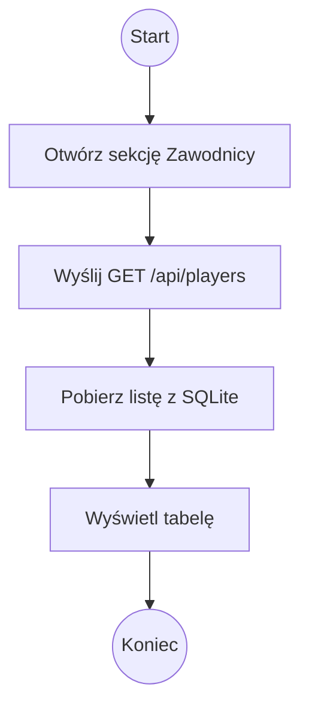

# Przeglądaj zawodników

```mermaid
flowchart TD
  A((Start))
  N1["Otwórz sekcję Zawodnicy"]
  N2["Wyślij GET /api/players"]
  N3["Pobierz listę z SQLite"]
  N4["Wyświetl tabelę"]
  Z((Koniec))
  A --> N1
  N1 --> N2
  N2 --> N3
  N3 --> N4
  N4 --> Z
```
