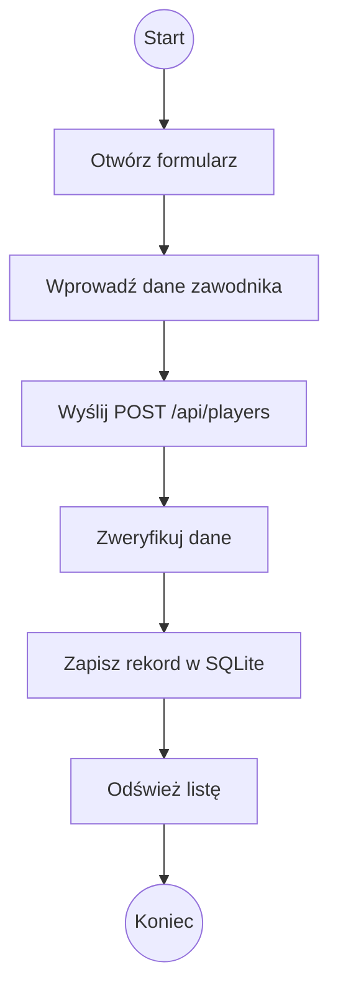

# Dodaj zawodnika

```mermaid
flowchart TD
  A((Start))
  N1["Otwórz formularz"]
  N2["Wprowadź dane zawodnika"]
  N3["Wyślij POST /api/players"]
  N4["Zweryfikuj dane"]
  N5["Zapisz rekord w SQLite"]
  N6["Odśwież listę"]
  Z((Koniec))
  A --> N1
  N1 --> N2
  N2 --> N3
  N3 --> N4
  N4 --> N5
  N5 --> N6
  N6 --> Z
```
