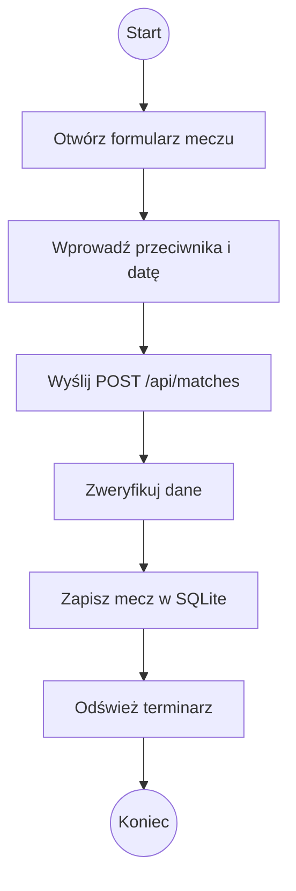

# Dodaj mecz

```mermaid
flowchart TD
  A((Start))
  N1["Otwórz formularz meczu"]
  N2["Wprowadź przeciwnika i datę"]
  N3["Wyślij POST /api/matches"]
  N4["Zweryfikuj dane"]
  N5["Zapisz mecz w SQLite"]
  N6["Odśwież terminarz"]
  Z((Koniec))
  A --> N1
  N1 --> N2
  N2 --> N3
  N3 --> N4
  N4 --> N5
  N5 --> N6
  N6 --> Z
```
