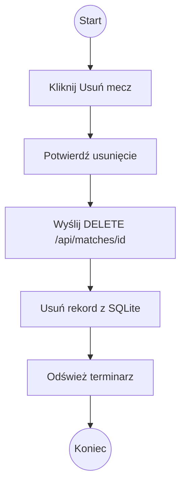

# Usuń mecz

```mermaid
flowchart TD
  A((Start))
  N1["Kliknij Usuń mecz"]
  N2["Potwierdź usunięcie"]
  N3["Wyślij DELETE /api/matches/id"]
  N4["Usuń rekord z SQLite"]
  N5["Odśwież terminarz"]
  Z((Koniec))
  A --> N1
  N1 --> N2
  N2 --> N3
  N3 --> N4
  N4 --> N5
  N5 --> Z
```
